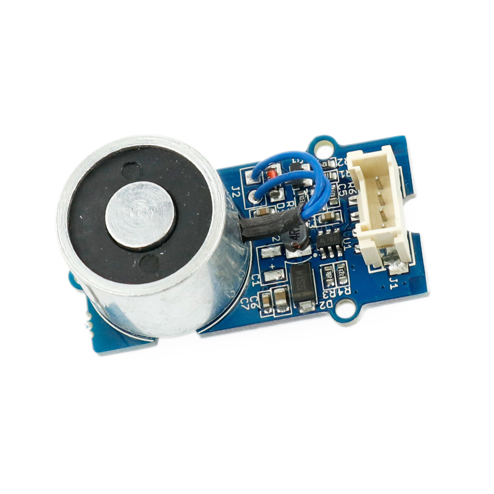

---
title: "Elektromagnet"
date: "2018-10-01T14:29:58.000Z"
tags: 
  - "output"
coverImage: "49_elektromagnet.jpg"
material_number: "49"
material_type: "output"
material_short_descr: "Seeed Studio Grove – Electromagnet"
manufacture: "Seeed Studio"
manufacture_url: "https://www.seeedstudio.com/"
repo_name: "mks-SeeedStudio-Grove_Electromagnet"
product_url: "https://wiki.seeedstudio.com/Grove-Electromagnet/"
clone_url: "https://github.com/Make-Your-School/mks-SeeedStudio-Grove_Electromagnet.git"
repo_prefix: "mks"
repo_part: "Grove_Electromagnet"
embedded_example_file: "examples/Grove_Electromagnet_minimal/Grove_Electromagnet_minimal.ino"
---

# Elektromagnet

## Beschreibung
Beim Elektromagneten handelt es sich um einen Magneten, der über eine angelegte Spannung aktiviert oder deaktiviert werden kann. Das Funktionsprinzip beruht auf der physikalischen Eigenschaft einer stromdurchflossenen Spule, die ein Magnetfeld um sich herum aufbaut. Da Spulen und Elektromagnete Ströme induzieren, die der angelegten Spannung entgegen gerichtet sind, dürfen Mikrocontroller nicht direkt an den Elektromagneten angeschlossen werden. Dieser könnte sonst beschädigt werden. Das hier vorliegende Board beinhaltet alle wichtigen Schutzschaltungen, sodass  ein Arduino oder Raspberry Pi direkt oder mithilfe des Grove Shields angeschlossen werden können. Mit einem einfachen \[simple\_tooltip content='

Digital vs. Analog:

- Analoge Signale können beliebige, kontinuierliche Werte annehmen. Sie verändern sich stufenlos. Dadurch können theoretisch unendlich kleine Änderungen (und damit ein unendlicher Informationsinhalt) übertragen werden. Einschränkend wirkt die Genauigkeit, mit der das analoge Signal ausgelesen/erfasst wird.
- Das digitale Signal nimmt nur diskrete Werte an und springt bei einer etwaigen Änderung von einem Wert zum nächsten. Es kann nur eine definierte Anzahl an Informationsinhalten übertragen werden. Vorteilhaft ist dagegen die damit verbundene Fehlerfreiheit bei minimalsten, ungewollten Schwankungen. Oftmals werden nur zwei Werte HIGH und LOW (Ein/Aus oder 1/0) übermittelt.

'\]digitalen HIGH-Signal\[/simple\_tooltip\] wird der Magnet angeschaltet. Der Elektromagnet kann hierbei ein Gewicht von ca. 1 kg tragen.

Alle weiteren Hintergrundinformationen sowie ein Beispielaufbau und alle notwendigen Programmbibliotheken sind auf dem offiziellen Wiki (bisher nur in englischer Sprache) von Seeed Studio zusammengefasst. Zusätzlich findet man über alle gängigen Suchmaschinen meist nur mit der Eingabe der genauen Komponenten-Bezeichnungen entsprechende Projektbeispiele und Tutorials.

<!-- infolist -->

<!-- infolists -->
## Wichtige Links für die ersten Schritte:

- [Seeed Studio Wiki](http://wiki.seeedstudio.com/Grove-Electromagnet/) [- Elektromagnet](http://wiki.seeedstudio.com/Grove-Electromagnet/)

## Weiterführende Hintergrundinformationen:

- [GPIO - Wikipedia Artikel](https://de.wikipedia.org/wiki/Allzweckeingabe/-ausgabe)
- [GitHub-Repository: Elektromagnet](https://github.com/MakeYourSchool/49-Elektromagnet)

